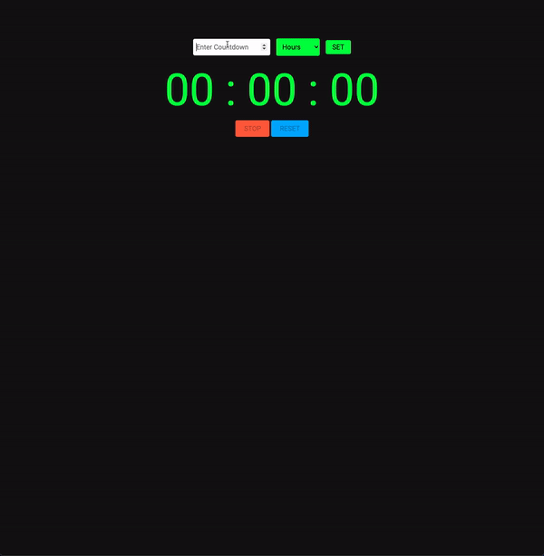

### Countdown App

> JavaScript Hours, Minutes, Seconds countdown web app.

## Live Demo

Preview: https://pirci.github.io/countdown/

## What I Learned:

- Implement **document.querySelector()**.
- Using **if condition** logic on button click.
- Using function **addEventListener()** method.
- Basic HTML and CSS structure & style.

## Possible Improvements

> Any type of suggestions/improvements to this repo are always welcome.
